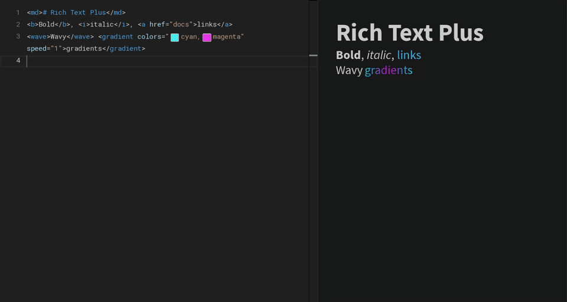

# RichTextPlus
Rich text for Roblox `TextLabel`s, entirely in Luau <br>
Images, links, gradients, effects, markdown and code on top of Roblox RichText <br>
Untrusted text is gated by intents, bitfields of the tags a label may use <br>

**Docs: [rich-text-plus.perthys.cc](https://rich-text-plus.perthys.cc)** (guides and full API reference)



## Guide
>[Docs](https://rich-text-plus.perthys.cc) <br>
>[Supports](#Supports) <br>
>[Install](#Install) <br>
>[Usage](#Usage) <br>
>[API](#API) <br>
>[More in the docs](#more-in-the-docs) <br>
>[Maintainers](#Maintainers) <br>

## Supports
- Roblox RichText tags, unchanged
- ``, `<a>`, `<hr/>`, `<code>`, `<codeblock lang="luau">`, `<gradient>`, `<wave>`, `<shake>`, `<indent>`, `<dir>`
- `<md>` markdown bodies
- Custom tags and effects inside `<customclass>`
- Interactive elements: query and bind any tag with Roblox `QueryDescendants` selectors, `hovercolor` / `presscolor` attributes
- Intent flags, with presets `Default`, `Trusted`, `Chat`, `Plain`
- The label's own size, font, color, wrapping, `TextScaled`, `AutomaticSize`, `MaxVisibleGraphemes`, `UIPadding`, `UIStroke`

## Install

**Wally**
```toml
RichTextPlus = "perthys/rich-text-plus@0.2.0"
```

**From source**
```sh
git clone https://github.com/Perthys/rich-text-plus
cd rich-text-plus
wally install
rojo build bundle.project.json -o RichTextPlus.rbxm
```

For luau-lsp types: `rojo sourcemap -o sourcemap.json && wally-package-types --sourcemap sourcemap.json Packages/` <br>

## Usage
```luau
local RichTextPlus = require(ReplicatedStorage.Packages.RichTextPlus)

local Renderer = RichTextPlus.new(Label)
    :SetPreset("Trusted")
    :SetTheme({LinkColor = Color3.fromRGB(90, 170, 255)})
    :AddCustomClass("rainbow", {
        Kind = "Effect";
        Update = function(Frame)
            Frame.Color = Color3.fromHSV((Frame.Time * 0.3 + Frame.Seed) % 1, 0.8, 1)
        end;
    })

Label.Text = `<b>Hello</b> <customclass><rainbow>world</rainbow></customclass>, read <a href="rules">the rules</a>`

Renderer:Bind("a", {
    Activated = function(Link)
        print(Link:GetAttribute("href"), Link.Text) -- rules the rules
    end;
})
```

Any tag is an element, selected like `Instance:QueryDescendants`
```luau
Label.Text = `<b class="shop"><font id="buy" hovercolor="#FFD000">Buy</font> or <a href="info">read more</a></b>`

Renderer:Bind(".shop >> #buy", {
    Activated = function(Buy) Purchase() end;
    HoverChanged = function(Buy, Hovering) Tooltip.Visible = Hovering end;
})

for _, Link in Renderer:QueryDescendants("a:not([$href = info])") do print(Link.Text) end
```

Player text gets a preset with limits, or exactly the flags you grant
```luau
local Intents = RichTextPlus.Intents

RichTextPlus.new(ChatLabel):SetPreset("Chat")
RichTextPlus.new(NameLabel):SetIntents({"Formatting", "Color", "Links"})
RichTextPlus.new(SignLabel):SetPreset("Chat"):SetIntents(Intents.Presets.Chat:Add("Links"))
```

## API
**`RichTextPlus.new(Label: TextLabel)` `-> Renderer`** - takes over the label, set text with `Label.Text` <br/>
**`Renderer:Flush()` `-> Renderer`** - render pending changes now instead of next frame <br/>
**`Renderer:Rebuild()`** - reparse everything <br/>
**`Renderer:Destroy()`** - hands the label back with its properties restored <br/>
**`Renderer:GetGraphemeCount()` `-> number`** - for `MaxVisibleGraphemes` reveals <br/>

Setters return the renderer and only mark it dirty, so a chain renders once, next frame or on `Flush()` <br/>
**`:SetPreset(Preset)`** - intents, limits and denied handling of `Default`, `Trusted`, `Chat` or `Plain` <br/>
**`:SetIntents(Flags)`** / **`:GetIntents()`** - flag names, a bitfield, an `Intents` object or a preset name <br/>
**`:SetLimits(Preset | Limits)`** / **`:GetLimits()`** - `Depth`, `Nodes`, `Characters`, `Objects`, `TextSize = {Min, Max}` <br/>
**`:SetDenied("Escape" | "Strip")`** / **`:GetDenied()`** - what happens to tags the intents do not grant <br/>
**`:SetAssetFilter(Filter?)`** / **`:AllowsAsset(Id)`** - allowlist map or function of the canonical asset id <br/>
**`:SetScale(number)`** / **`:GetScale()`** - multiplies markup sizes <br/>
**`:SetTheme(Theme?)`** / **`:GetTheme()`** - markdown, code and link colors (`LinkColor`, `LinkHoverColor`) <br/>
**`:SetWhitespace("Preserve" | "Markup")`** / **`:GetWhitespace()`** - `Markup` ignores indentation between tags <br/>
**`:SetRendering(Name, Enabled)`** / **`:GetRendering(Name)`** - `Passthrough`, `Culling`, `Clipping`, `SyntaxHighlight` <br/>
**`:AddCustomClass(Name, Definition)`** / **`:AddCustomClasses(Map)`** / **`:RemoveCustomClass(Name)`** <br/>

**`Renderer:QueryDescendants(Selector)` `-> {Element}`** / **`:QueryFirst(Selector)` `-> Element?`** - tag for class, `.word` of `class`, `#id`, `[$attr = value]`, `[Text = x]`, `>`, `>>`, `,`, `:not()`, `:has()`, `:Hover`, `:Press`, `:Focus` <br/>
**`Renderer:Bind(Selector, {Activated, HoverChanged, PressChanged})` `-> Connection`** - handles input on matching elements, now and after re-renders <br/>
**`Element`** - `.Tag`, `.Id`, `.Text`, `.Parent`, `.Children`, `.State {Hovered, Pressed, Focused, Visible}`, `:GetAttribute(Name)`, `:QueryDescendants(Selector)`, signals `Activated`, `HoverChanged(Hovering)`, `PressChanged(Pressing)` <br/>

**`RichTextPlus.Runtime`** - `Preload`, `Flush`, `SetFrameBudget`, `SetPoolLimit`, `SetProfiling` <br/>
**`RichTextPlus.Intents`** - `Flags`, `Presets`, `Tags`, `new(...)`, `Resolve(Value)`; objects have `Has`, `Any`, `Add`, `Remove`, `Toggle`, `ToArray`, `Serialize`, `Equals`, `Freeze`, `Allows`, `.Bitfield` <br/>
**`RichTextPlus.Utilities`** - `Escape`, `Unescape`, `Strip`, `Markdown`, `Highlight`, `ParseColor`, `Attribute`, `CanonicalId` <br/>

**Flags** - `Formatting` (b i u s), `LineBreaks`, `Color` (font color), `Font` (other font attributes), `Stroke`, `Mark`, `Casing`, `Images`, `Links`, `Gradients`, `Effects`, `Markdown`, `Code`, `CodeBlocks`, `Rules` (hr), `Direction`, `Indent`, `CustomClasses`, `Controls` (control and bidi characters kept) <br/>

## More in the docs
Guides and the full API reference live at [rich-text-plus.perthys.cc](https://rich-text-plus.perthys.cc) <br>
>[Getting started](https://rich-text-plus.perthys.cc/docs/intro) <br>
>[Custom classes](https://rich-text-plus.perthys.cc/docs/custom-classes) <br>
>[Security](https://rich-text-plus.perthys.cc/docs/security) <br>
>[Markdown](https://rich-text-plus.perthys.cc/docs/markdown) <br>
>[Host label properties](https://rich-text-plus.perthys.cc/docs/host-properties) <br>
>[Architecture](https://rich-text-plus.perthys.cc/docs/architecture) <br>
>[API reference](https://rich-text-plus.perthys.cc/api/RichTextPlus) <br>

## Maintainers
- [Perth](https://github.com/Perthys) | `Perthys#0`
